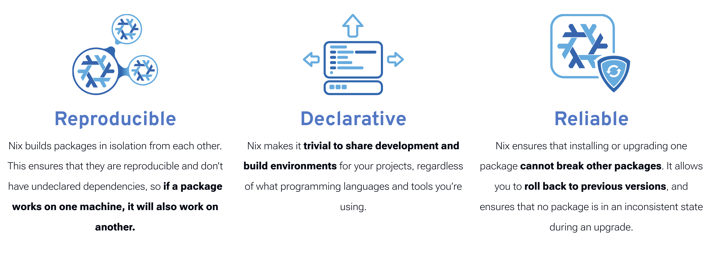

## Narzędzia odtwarzalne

Obecnie korzystam z:
- **[uv](https://github.com/astral-sh/uv)** 🚀  jest to menedżer bibliotek do Pythona, który ułatwia organizację oraz zapewnia reprodukowalność. Działa 10-100x szybciej niż `pip` oraz w pełni zastępuje narzędzia takie jak `poetry`, `virtualenv`, `pyenv`. 

- **Jupyter Notebook** (Python) oraz **Quarto** (R/Python) – tych narzędzi raczej nie trzeba przedstawiać. Quarto to taki nowszy RMarkdown.
- **[Nix/NixOS](https://nixos.org/)** ❄️ pozwala na deklaratywną i odtwarzalną konfigurację **całego** systemu Linux od niskiego poziomu (kernel), narzędzia CLI, po środowisko graficzne. Jest to również przydatne w kontekście Data Science. Tutaj taki poradnik jak można to zastosować, ale póki co nie jestem na tyle zaawansowany [Reproducible Analytical Pipelines](https://b-rodrigues.github.io/rap4mads_2023/). Ponadto nix może zastępować Dockera (też narzędzie do RR). 

- $\LaTeX$ (przez [Overleaf](https://overleaf.uw.edu.pl/)) pomaga tworzyć reprodukowalne dokumenty, przydaje mi się do tworzenia prac zaliczeniowych i prezentacji. W tej kategorii korzystam też z **Typst**, który pretenduje do bycia bardziej nowoczesną, bardziej przyjazną dla użytkownika alternatywą dla $\LaTeX$. 
- I na końcu oczywiście **git**, z którego korzystam przez terminal.   

