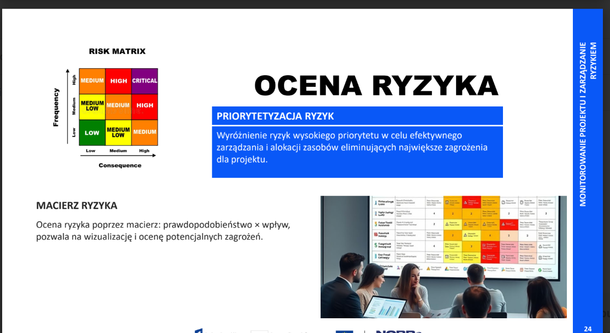

# Zajęcia 11. Analiza ryzyka i macierz ryzyka.

## Zadanie 2
Jednym z najważniejszych ryzyk w projektowaniu systemu IT jest **niedostateczne zrozumienie wymagań użytkowników**. 

**Prawdopodobieństwo wystąpienia**:
- **Wysokie** (3/5) – Wiele projektów ma problem z niejasnymi lub zmieniającymi się wymaganiami.
**Potencjalny wpływ**:
- **Wysoki** (4/5) – Niezrealizowanie oczekiwań użytkowników może prowadzić do dużych strat finansowych i utraty klientów.
**Poziom ryzyka**:
Na podstawie tych ocen, ryzyko to można określić jako **wysokie** (12/25) w skali 5x5. Dlatego ważne jest, aby dokładnie zbierać i weryfikować wymagania użytkowników na każdym etapie projektu.

## Ciekawostka:
W tym tygodniu byłem na warsztatach i też pojawiła się macierz ryzyka! 

